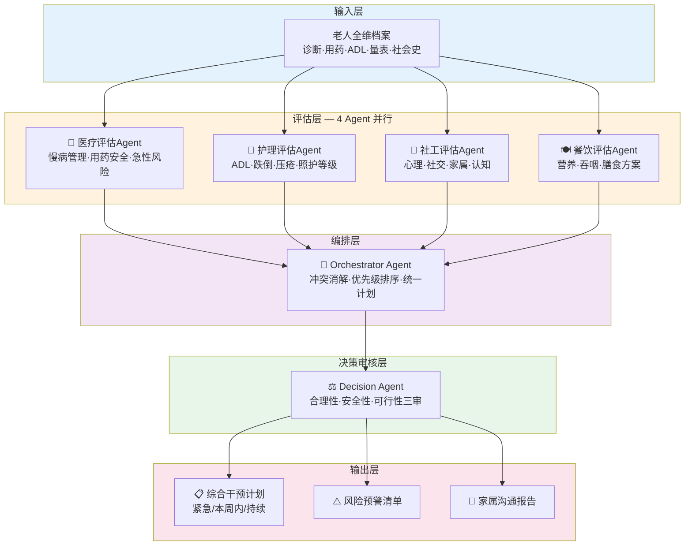
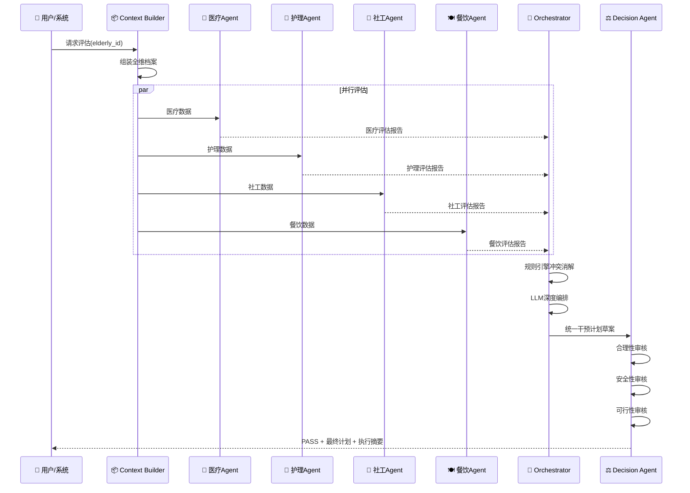
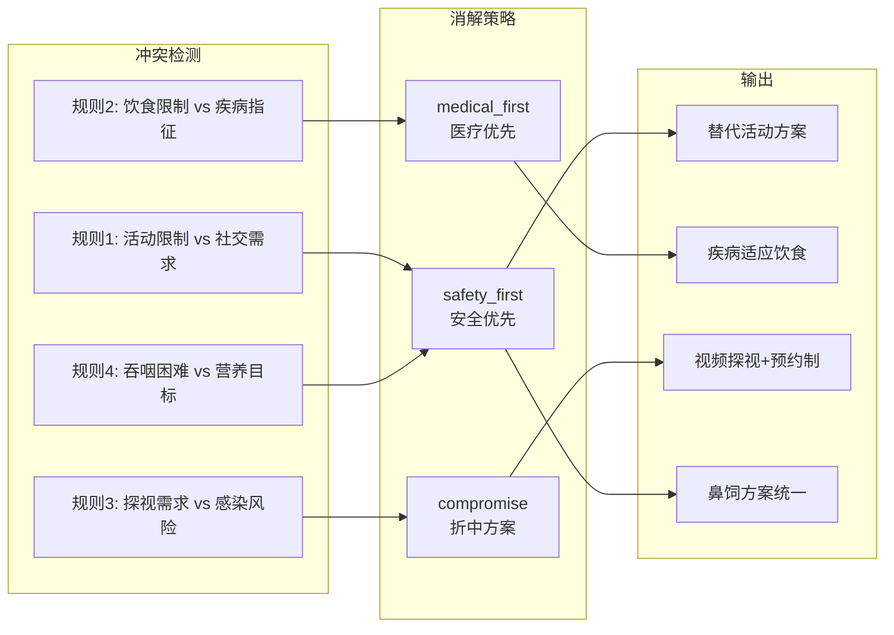

# CareMind 系统架构图（Mermaid + 文本版）

## 1. 分层架构图（Mermaid 格式 — 可复制到 Mermaid Live Editor 渲染为PNG）

## 2. Agent数据流图

## 3. 冲突消解流程图

## 4. 照护案例×Agent干预强度矩阵

|  | 🏥 医疗 | 💉 护理 | 🤝 社工 | 🍽️ 餐饮 |
|---|:---:|:---:|:---:|:---:|
| **王奶奶** (轻度失能) | ★★☆ | ★★☆ | ★★★★★ | ★★★☆ |
| **李爷爷** (中度失能) | ★★★★★ | ★★★★☆ | ★★☆ | ★★★★☆ |
| **张爷爷** (重度失能) | ★★★★☆ | ★★★★★ | ★★★☆ | ★★★★★ |

> ★数量 = 干预强度和紧急程度。对PPT展示时用热力图颜色：绿(低)→黄(中)→橙(高)→红(极高)
